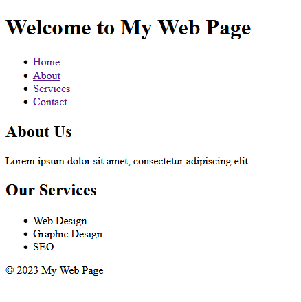

# Chapter 2 - Introduction
 
### Project Setup - Windows
1) Open Run Window

    ```
    START + R
    ```

2) Go to Command Prompt

    ```
    cmd
    ```

3) Go to Desktop

    ```
    cd Desktop
    ```

4) Create a Project Folder

    ```
    mkdir web
    ```

5) Go to Project Folder

    ```
    cd web
    ```

6) Open VSCode

    ```
    code .
    ```

7) Create HTML File

    ```
    index.html
    ```

### Project Setup - Linux

1) Open Activities

    ```
    START
    ```

2) Go to Command Prompt

    ```
    terminal
    ```

3) Go to Desktop

    ```
    cd Desktop
    ```

4) Create a Project Folder

    ```
    mkdir web
    ```

5) Go to Project Folder

    ```
    cd web
    ```

6) Open VSCode

    ```
    code .
    ```

7) Create HTML File

    ```
    index.html
    ```

### Project Setup - macOS

1) Open Activities

```
START
```

2) Go to Command Prompt

    ```
    terminal
    ```

3) Go to Desktop

    ```
    cd Desktop
    ```

4) Create a Project Folder

    ```
    mkdir web
    ```

5) Go to Project Folder

    ```
    cd web
    ```

6) Open VSCode

    ```
    code .
    ```

7) Create HTML File

    ```
    index.html
    ```

open `index.html`

```
<!DOCTYPE html>
<html>
<head>
    <meta charset="UTF-8">
    <title>My Web Page</title>
</head>
<body>
    <header>
        <h1>Welcome to My Web Page</h1>
    </header>

    <nav>
        <ul>
            <li><a href="#">Home</a></li>
            <li><a href="#">About</a></li>
            <li><a href="#">Services</a></li>
            <li><a href="#">Contact</a></li>
        </ul>
    </nav>

    <main>
        <section>
            <h2>About Us</h2>
            <p>Lorem ipsum dolor sit amet, consectetur adipiscing elit.</p>
        </section>

        <section>
            <h2>Our Services</h2>
            <ul>
                <li>Web Design</li>
                <li>Graphic Design</li>
                <li>SEO</li>
            </ul>
        </section>
    </main>

    <footer>
        <p>&copy; 2023 My Web Page</p>
    </footer>
</body>
</html>
```

