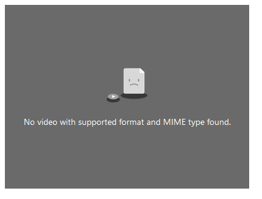

# Chapter 3 - HTML Elements
 
1. Heading Elements

```
<!DOCTYPE html>
<html>
<head>
    <meta charset="UTF-8">
    <title>My Web Page</title>
</head>
<body>
    
    <h1>This is a Heading 1</h1>
    <h2>This is a Heading 2</h2>
    <h3>This is a Heading 3</h3>
    <h4>This is a Heading 4</h4>
    <h5>This is a Heading 5</h5>
    <h6>This is a Heading 6</h6>

</body>
</html>
```


3. Paragraph

```
<!DOCTYPE html>
<html>
<head>
    <meta charset="UTF-8">
    <title>My Web Page</title>
</head>
<body>

    <p>This is a paragraph of text. It can contain <a href="#">links</a> and other <em>emphasized</em> text.</p>

</body>
</html>
```


5. Links

```
<!DOCTYPE html>
<html>
<head>
    <meta charset="UTF-8">
    <title>My Web Page</title>
</head>
<body>

    <a href="https://www.example.com">Visit Example.com</a>

</body>
</html>
```


8. Lists - Unordered List

```
<!DOCTYPE html>
<html>
<head>
    <meta charset="UTF-8">
    <title>My Web Page</title>
</head>
<body>

    <ul>
        <li>Item 1</li>
        <li>Item 2</li>
        <li>Item 3</li>
    </ul>

</body>
</html>
```


10. Lists - Ordered List

```
<!DOCTYPE html>
<html>
<head>
    <meta charset="UTF-8">
    <title>My Web Page</title>
</head>
<body>

    <ol>
        <li>First Item</li>
        <li>Second Item</li>
        <li>Third Item</li>
    </ol>    

</body>
</html>
```


12. Images

```
<!DOCTYPE html>
<html>
<head>
    <meta charset="UTF-8">
    <title>My Web Page</title>
</head>
<body>

      

</body>
</html>
```


15. Tables

```
<!DOCTYPE html>
<html>
<head>
    <meta charset="UTF-8">
    <title>My Web Page</title>
</head>
<body>

    <table>

        <thead>

            <tr>
                <th>Id</th>
                <th>Name</th>
                <th>Action</th>
            </tr>

        </thead>

        <tbody>

            <tr>
                <td>1</td>
                <td>Action</td>
                <td>
                    <a href="">Edit</a>
                    <a href="">Delete</a>
                </td>
            </tr>

            <tr>
                <td>2</td>
                <td>Adventure</td>
                <td>
                    <a href="">Edit</a>
                    <a href="">Delete</a>
                </td>
            </tr>

        </tbody>
        
    </table>    

</body>
</html>
```


17. Forms

```
<!DOCTYPE html>
<html>
<head>
    <meta charset="UTF-8">
    <title>My Web Page</title>
</head>
<body>

    <form action="/submit" method="post">

        <label for="username">Username:</label>

        <input type="text" id="username" name="username" required>
    
        <label for="password">Password:</label>

        <input type="password" id="password" name="password" required>
    
        <textarea id="comments" name="comments" rows="4" cols="50"></textarea>
    
        <button type="submit">Submit</button>
        
    </form>    

</body>
</html>
```


19. Semantic Elements

```
<!DOCTYPE html>
<html>
<head>
    <meta charset="UTF-8">
    <title>My Web Page</title>
</head>
<body>

    <header>
        <h1>Website Header</h1>
    </header>
    
    <nav>
        <ul>
            <li><a href="#">Home</a></li>
            <li><a href="#">About</a></li>
            <li><a href="#">Contact</a></li>
        </ul>
    </nav>
    
    <main>
        <article>
            <h2>Article Title</h2>
            <p>This is the main content of the article.</p>
        </article>
    </main>
    
    <footer>
        <p>&copy; 2023 Your Website</p>
    </footer>
        

</body>
</html>
```


21. HTML5 Video

```
<!DOCTYPE html>
<html>
<head>
    <meta charset="UTF-8">
    <title>My Web Page</title>
</head>
<body>

    <video controls width="400" height="300">
        <source src="video.mp4" type="video/mp4">
        Your browser does not support the video tag.
    </video>                    

</body>
</html>
```




25. HTML5 Audio

```
<!DOCTYPE html>
<html>
<head>
    <meta charset="UTF-8">
    <title>My Web Page</title>
</head>
<body>
    
    <audio controls>
        <source src="audio.mp4" type="audio/mpeg">
        Your browser does not support the audio tag.
    </audio>            

</body>
</html>
```


29. Page Title

```
<!DOCTYPE html>
<html lang="en">
<head>
    <meta charset="UTF-8">
    <meta name="viewport" content="width=device-width, initial-scale=1.0">

    <title>HTML Tutorial</title>

</head>
<body>

    The content of the document......
    
</body>
</html>
```


31. Favicon

A favicon image is displayed to the left of the page title in the browser tab, like this:

```
<!DOCTYPE html>
<html lang="en">
<head>
    <meta charset="UTF-8">
    <meta name="viewport" content="width=device-width, initial-scale=1.0">
    <title>Document</title>

    <link rel="icon" type="image/x-icon" href="favicon.ico">

</head>
<body>
    
</body>
</html>
```


34. Break

```
<!DOCTYPE html>
<html lang="en">
<head>
    <meta charset="UTF-8">
    <meta name="viewport" content="width=device-width, initial-scale=1.0">
    <title>Document</title>
</head>
<body>

    <p>This is some text before the line break.<br>This is text after the line break.</p>
    
</body>
</html>
```


36. Horizontal Rule

```
<!DOCTYPE html>
<html lang="en">
<head>
    <meta charset="UTF-8">
    <meta name="viewport" content="width=device-width, initial-scale=1.0">
    <title>Document</title>
</head>
<body>

    <p>This is some text above the horizontal rule.</p>
    
    <hr>

    <p>This is some text below the horizontal rule.</p>
    
</body>
</html>
```

