# Chapter 4 - Text Formatting
 
1. Bold Text

```
<!DOCTYPE html>
<html lang="en">
<head>
    <meta charset="UTF-8">
    <meta name="viewport" content="width=device-width, initial-scale=1.0">
    <title>Document</title>
</head>
<body>

    <p>This is <b>bold</b> text.</p>
    
    <p>This is <strong>strong</strong> text.</p>
    
</body>
</html>
```

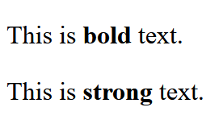

3. Italic Text

```
<!DOCTYPE html>
<html lang="en">
<head>
    <meta charset="UTF-8">
    <meta name="viewport" content="width=device-width, initial-scale=1.0">
    <title>Document</title>
</head>
<body>

    <p>This is <i>italic</i> text.</p>
    
    <p>This is <em>emphasized</em> text.</p>
    
</body>
</html>
```

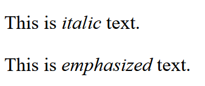

5. Underlined Text

```
<!DOCTYPE html>
<html lang="en">
<head>
    <meta charset="UTF-8">
    <meta name="viewport" content="width=device-width, initial-scale=1.0">
    <title>Document</title>
</head>
<body>

  <p>This is <u>underlined</u> text.</p>

  <p>This is an <ins>inserted</ins> text.</p>
    
</body>
</html>
```

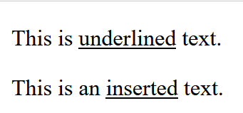

7. Strikethrough Text

```
<!DOCTYPE html>
<html lang="en">
<head>
    <meta charset="UTF-8">
    <meta name="viewport" content="width=device-width, initial-scale=1.0">
    <title>Document</title>
</head>
<body>

    <p>This is <s>strikethrough</s> text.</p>
    
    <p>This is <del>deleted</del> text.</p>
    
</body>
</html>
```

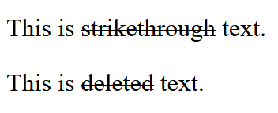

9. Superscript

```
<!DOCTYPE html>
<html lang="en">
<head>
    <meta charset="UTF-8">
    <meta name="viewport" content="width=device-width, initial-scale=1.0">
    <title>Document</title>
</head>
<body>

    <p>This is <sup>superscript</sup> text.</p>
    
</body>
</html>
```

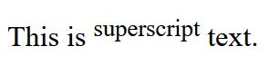

11. Subscript

```
<!DOCTYPE html>
<html lang="en">
<head>
    <meta charset="UTF-8">
    <meta name="viewport" content="width=device-width, initial-scale=1.0">
    <title>Document</title>
</head>
<body>

    <p>This is <sub>subscript</sub> text.</p>
    
</body>
</html>
```

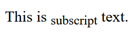

13. Marked Text

```
<!DOCTYPE html>
<html lang="en">
<head>
    <meta charset="UTF-8">
    <meta name="viewport" content="width=device-width, initial-scale=1.0">
    <title>Document</title>
</head>
<body>

    <p>This is <mark>highlighted</mark> text.</p>
    
</body>
</html>
```

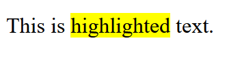

15. Inline Code

```
<!DOCTYPE html>
<html lang="en">
<head>
    <meta charset="UTF-8">
    <meta name="viewport" content="width=device-width, initial-scale=1.0">
    <title>Document</title>
</head>
<body>

    <h1>Hello World</h1>

    <p>Program to Display "Hello, World!"</p>

    <code>
        #include&lt;stdio.h&gt; <br>
        #include&lt;conio.h&gt; <br>
        int main() <br>
        {   <br>

            clrscr(); <br>
            printf("Hello world");<br>

            getch(); <br>
        }
    </code>
    
</body>
</html>
```

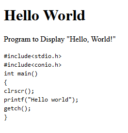

17. Blockquote

```
<!DOCTYPE html>
<html lang="en">
<head>
    <meta charset="UTF-8">
    <meta name="viewport" content="width=device-width, initial-scale=1.0">
    <title>Document</title>
</head>
<body>

    <blockquote>
        This is a blockquote. It is often used for quoting text from another source.
    </blockquote>    
    
</body>
</html>
```

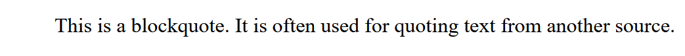

19. Citations

```
<!DOCTYPE html>
<html lang="en">
<head>
    <meta charset="UTF-8">
    <meta name="viewport" content="width=device-width, initial-scale=1.0">
    <title>Document</title>
</head>
<body>

    <p><cite>William Shakespeare</cite> wrote "To be or not to be."</p>    
    
</body>
</html>
```

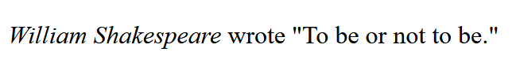


21. Abbreviations

```
<!DOCTYPE html>
<html lang="en">
<head>
    <meta charset="UTF-8">
    <meta name="viewport" content="width=device-width, initial-scale=1.0">
    <title>Document</title>
</head>
<body>

    <p>The <abbr title="World Health Organization">WHO</abbr> is an important organization.</p>
    
</body>
</html>
```

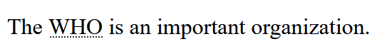

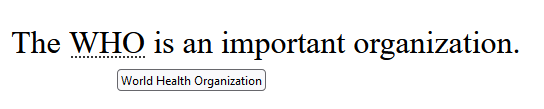