# Chapter 5 - Forms

1. Text Input

```
<!DOCTYPE html>
<html lang="en">
<head>
    <meta charset="UTF-8">
    <meta name="viewport" content="width=device-width, initial-scale=1.0">
    <title>Document</title>
</head>
<body>

    <form action="" method="get">

        <label for="username">Username:</label>
        
        <input type="text" id="username" name="username" placeholder="Enter your username">

        <input type="submit" value="send">

    </form>
    
</body>
</html>
```

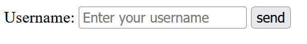

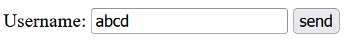

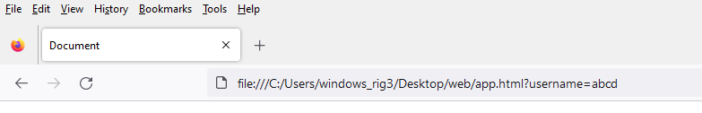

5. Password Input

```
<!DOCTYPE html>
<html lang="en">
<head>
    <meta charset="UTF-8">
    <meta name="viewport" content="width=device-width, initial-scale=1.0">
    <title>Document</title>
</head>
<body>

    <form action="" method="get">

        <label for="password">Password:</label>

        <input type="password" id="password" name="password" placeholder="Enter your password">

        <input type="submit" value="send">

    </form>
    
</body>
</html>
```

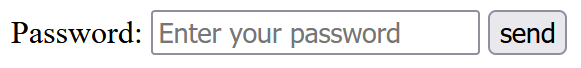

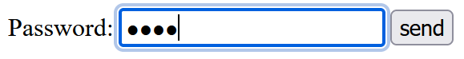


9. Email Input

```
<!DOCTYPE html>
<html lang="en">
<head>
    <meta charset="UTF-8">
    <meta name="viewport" content="width=device-width, initial-scale=1.0">
    <title>Document</title>
</head>
<body>

    <form action="" method="get">

        <label for="email">Email:</label>
        
        <input type="email" id="email" name="email" placeholder="Enter your email">

        <input type="submit" value="send">

    </form>
    
</body>
</html>
```

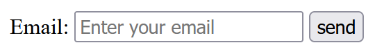

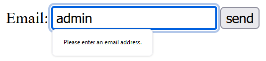

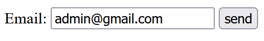

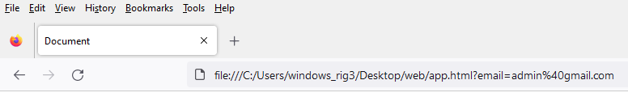


14. Number Input

```
<!DOCTYPE html>
<html lang="en">
<head>
    <meta charset="UTF-8">
    <meta name="viewport" content="width=device-width, initial-scale=1.0">
    <title>Document</title>
</head>
<body>

    <form action="" method="get">

        <label for="quantity">Quantity:</label>

        <input type="number" id="quantity" name="quantity" min="1" max="10" step="1">

        <input type="submit" value="send">

    </form>
    
</body>
</html>
```

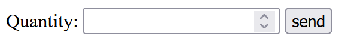


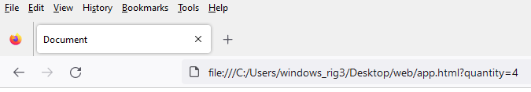


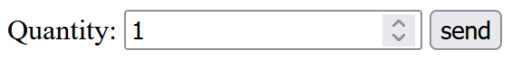

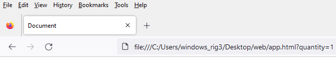


25. Checkbox

```
<!DOCTYPE html>
<html lang="en">
<head>
    <meta charset="UTF-8">
    <meta name="viewport" content="width=device-width, initial-scale=1.0">
    <title>Document</title>
</head>
<body>

    <form action="" method="get">

        <label for="subscribe">Subscribe to newsletter:</label>

        <input type="checkbox" id="subscribe" name="subscribe" value="yes">

        <input type="submit" value="send">

    </form>
    
</body>
</html>
```


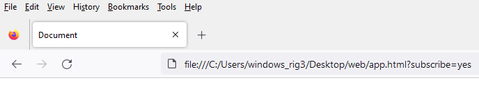

29. Radio Buttons

```
<!DOCTYPE html>
<html lang="en">
<head>
    <meta charset="UTF-8">
    <meta name="viewport" content="width=device-width, initial-scale=1.0">
    <title>Document</title>
</head>
<body>

    <form action="" method="get">

        <label>Gender:</label>
        
        <input type="radio" id="male" name="gender" value="male">
        
        <label for="male">Male</label>
        
        <input type="radio" id="female" name="gender" value="female">
        
        <label for="female">Female</label>

        <input type="submit" value="send">

    </form>
    
</body>
</html>
```

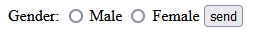


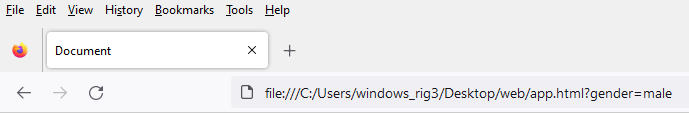

34. Text Area

```
<!DOCTYPE html>
<html lang="en">
<head>
    <meta charset="UTF-8">
    <meta name="viewport" content="width=device-width, initial-scale=1.0">
    <title>Document</title>
</head>
<body>

    <form action="" method="get">

        <label for="comments">Comments:</label>
        
        <textarea id="comments" name="comments" rows="4" cols="50" placeholder="Enter your comments"></textarea>

        <input type="submit" value="send">

    </form>
    
</body>
</html>
```

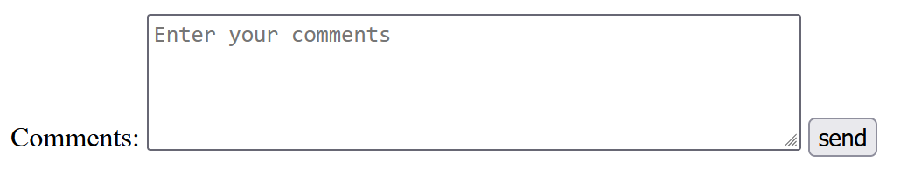

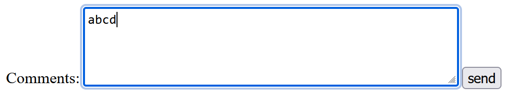

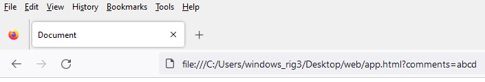

38. Select Dropdown

```
<!DOCTYPE html>
<html lang="en">
<head>
    <meta charset="UTF-8">
    <meta name="viewport" content="width=device-width, initial-scale=1.0">
    <title>Document</title>
</head>
<body>

    <form action="" method="get">

        <label for="country">Country:</label>

        <select id="country" name="country">

            <option value="usa">United States</option>

            <option value="canada">Canada</option>

            <option value="uk">United Kingdom</option>

        </select>
        
        <input type="submit" value="send">

    </form>
    
</body>
</html>
```

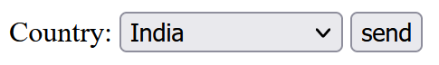

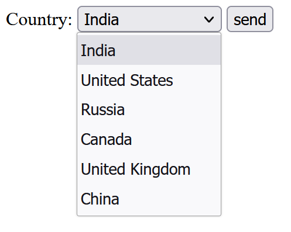


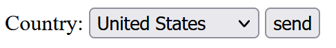

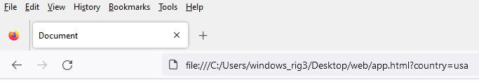

44. File Upload

```
<!DOCTYPE html>
<html lang="en">
<head>
    <meta charset="UTF-8">
    <meta name="viewport" content="width=device-width, initial-scale=1.0">
    <title>Document</title>
</head>
<body>

    <form action="" method="get">

        <label for="file">Upload a file:</label>

        <input type="file" id="file" name="file">
        
        <input type="submit" value="send">

    </form>
    
</body>
</html>
```

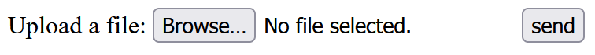

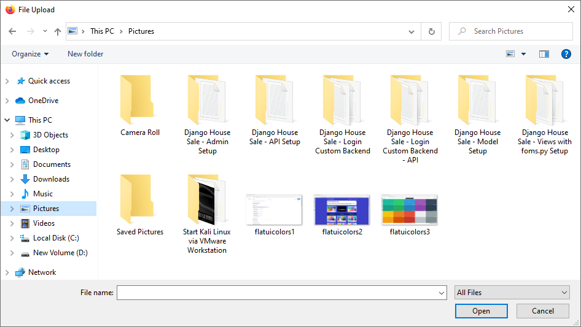

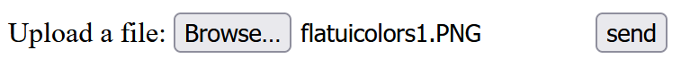

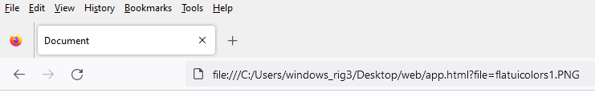

49. Date Input

```
<!DOCTYPE html>
<html lang="en">
<head>
    <meta charset="UTF-8">
    <meta name="viewport" content="width=device-width, initial-scale=1.0">
    <title>Document</title>
</head>
<body>

    <form action="" method="get">

        <label for="birthdate">Birthdate:</label>

        <input type="date" id="birthdate" name="birthdate">
        
        <input type="submit" value="send">

    </form>
    
</body>
</html>
```

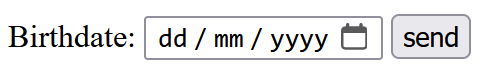

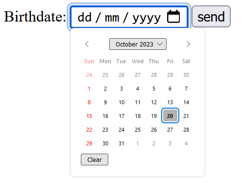

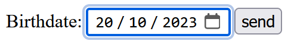

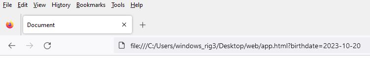